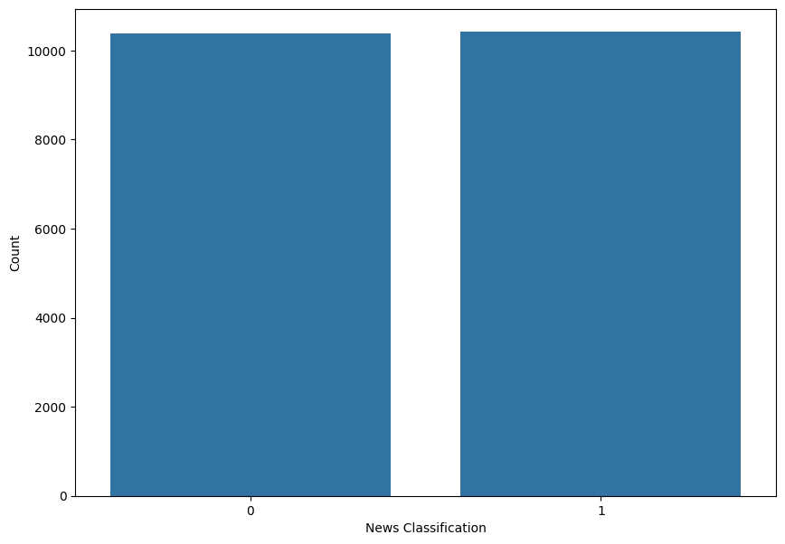
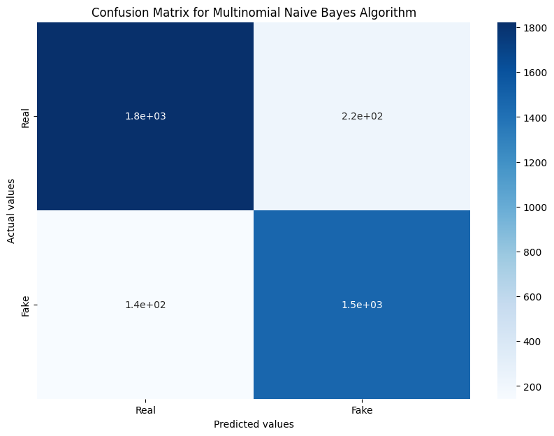

# 🔍 Fake News Classification using Natural Language Processing


A machine learning project that automatically classifies news headlines as **Real** or **Fake** using Natural Language Processing techniques and supervised learning algorithms.

## 📌 Project Overview

In today's digital age, the spread of misinformation has become a critical concern. This project addresses the challenge of fake news detection by building an automated classifier that can distinguish between authentic and fabricated news headlines with high accuracy.

### 🎯 Objectives

- ✅ Build an efficient text classification model for fake news detection
- ✅ Compare performance of different machine learning algorithms
- ✅ Implement comprehensive text preprocessing pipeline
- ✅ Achieve high accuracy in binary classification task
- ✅ Create a reusable prediction system for new headlines

## 🚀 Key Features

- **Advanced Text Preprocessing**: Comprehensive cleaning, tokenization, and stemming
- **Multiple ML Models**: Comparison between Naive Bayes and Logistic Regression
- **Hyperparameter Optimization**: Fine-tuned models for optimal performance
- **Interactive Predictions**: Test the model with random news headlines
- **Detailed Visualizations**: Confusion matrices and performance metrics
- **Scalable Architecture**: Easy to extend with new algorithms and features

## 📊 Dataset

- **Source**: Comprehensive Fake News Dataset
- **Data File**: `fake_news_dataset.csv` (20,000+ labeled articles)
- **Features**: Title, full text, date, source, author, category
- **Labels**: Binary classification ('real'/'fake' → 0/1)
- **Primary Feature**: News headlines/titles used for classification
- **Additional Context**: Full article text and metadata available for enhanced analysis

## 🛠️ Technology Stack

| Category | Technologies |
|----------|-------------|
| **Language** | Python 3.8+ |
| **ML Framework** | scikit-learn |
| **NLP Library** | NLTK |
| **Data Analysis** | Pandas, NumPy |
| **Visualization** | Matplotlib, Seaborn |
| **Development** | Jupyter Notebook |

## 📁 Project Structure

```
fake_news_classification_nlp/
│
├── 📒 Fake News Classifier.ipynb    # Main notebook with complete analysis
├── 📊 fake_news_dataset.csv         # Comprehensive dataset with news articles
├── 📋 README.md                     # Project documentation
│
├── 📁 Plots/                        # Generated visualizations
│   ├── 01_NewsClassification.png
│   ├── 02_ConfussionMatrix_NeiveBayes.png
│   └── 03_ConfussionMatrix_LogisticRegression.png

```

## 🔄 Methodology & Pipeline

### 1. 📚 Data Preprocessing
```python
# Text Cleaning Pipeline
1. Remove special characters and punctuation
2. Convert to lowercase
3. Tokenization (split into words)
4. Remove English stopwords
5. Apply Porter Stemming
6. Build corpus for vectorization
```

### 2. 🎯 Feature Engineering
- **Bag of Words Model**: CountVectorizer with max 5000 features
- **N-gram Analysis**: Unigrams, bigrams, and trigrams (1-3)
- **Sparse Matrix Representation**: Efficient memory usage for large vocabulary

### 3. 🤖 Machine Learning Models

#### Model 1: Multinomial Naive Bayes
- ⚡ **Fast training and prediction**
- 📊 **Excellent for text classification**
- 🎯 **Handles sparse data effectively**
- ⚙️ **Hyperparameter**: Alpha (smoothing parameter)

#### Model 2: Logistic Regression
- 📈 **Linear classifier with probabilistic output**
- 💡 **Interpretable feature weights**
- 🔧 **Works well with high-dimensional data**
- ⚙️ **Hyperparameter**: C (regularization strength)

### 4. 📊 Model Evaluation
- **Accuracy Score**: Overall prediction correctness
- **Precision**: True positive rate for fake news detection
- **Recall**: Coverage of actual fake news cases
- **Confusion Matrix**: Detailed error analysis

## 📈 Results & Performance

### 🏆 Model Performance Comparison

| Model | Best Accuracy | Precision | Recall | Optimal Parameter |
|-------|---------------|-----------|--------|-------------------|
| Multinomial Naive Bayes | ~89-92% | ~0.85-0.90 | ~0.85-0.90 | alpha = 0.1-0.3 |
| Logistic Regression | ~90-93% | ~0.87-0.92 | ~0.87-0.92 | C = 0.7-0.9 |

### 📊 Visualization Results

<div align="center">

#### Class Distribution

*Distribution of Real vs Fake news in the training dataset*

#### Naive Bayes Confusion Matrix

*Performance analysis of Multinomial Naive Bayes classifier*

#### Logistic Regression Confusion Matrix

*Performance analysis of Logistic Regression classifier*

</div>

## 🚀 Getting Started

### Prerequisites
```bash
# Required Python packages
pip install numpy pandas scikit-learn nltk matplotlib seaborn jupyter
```

### Installation & Setup

1. **Clone the repository**
```bash
git clone https://github.com/SurajK221b/fake_news_classification_nlp.git
cd fake_news_classification_nlp
```

2. **Download NLTK data**
```python
import nltk
nltk.download('stopwords')
```

3. **Extract datasets** (if using compressed files)
```bash
# Extract the 7z files if needed
7z x kaggle_fake_train.7z
7z x kaggle_fake_test.7z
```

### Running the Project

1. **Launch Jupyter Notebook**
```bash
jupyter notebook "Fake News Classifier.ipynb"
```

2. **Run all cells** sequentially to:
   - Load and explore the dataset
   - Preprocess text data
   - Train multiple models
   - Evaluate performance
   - Make predictions on test data

3. **Test with custom headlines**
```python
# Use the fake_news() function to test custom headlines
sample_headline = "Breaking: Scientists discover amazing new technology"
prediction = fake_news(sample_headline)
print("Real News" if prediction == 0 else "Fake News")
```

## 📋 Step-by-Step Execution Guide

### Phase 1: Data Exploration 🔍
1. Load the comprehensive dataset (`fake_news_dataset.csv`)
2. Explore data structure, features, and sample entries
3. Examine available metadata (source, author, category, date)
4. Visualize class distribution (Real vs Fake)
5. Check for missing values and data quality
6. Convert text labels to numeric format for ML algorithms

### Phase 2: Text Preprocessing 🔄
1. Analyze dataset structure and features
2. Convert text labels ('real'/'fake') to numeric format (0/1)
3. Clean text data:
   - Remove special characters using regex
   - Convert to lowercase
   - Tokenize into words
4. Apply NLP techniques:
   - Remove English stopwords
   - Apply Porter Stemming
   - Build text corpus

### Phase 3: Feature Engineering 🎯
1. Create Bag of Words model using CountVectorizer
2. Configure parameters:
   - `max_features=5000` (top 5000 words)
   - `ngram_range=(1,3)` (1-3 word combinations)
3. Transform text to numerical feature matrix
4. Extract target labels from dataset

### Phase 4: Model Training 🤖
1. Split data (80% train, 20% test)
2. Train Multinomial Naive Bayes:
   - Fit model on training data
   - Evaluate on test set
   - Calculate accuracy, precision, recall
   - Generate confusion matrix
   - Tune alpha parameter (0.1 to 1.0)
3. Train Logistic Regression:
   - Fit model on training data
   - Evaluate performance metrics
   - Visualize confusion matrix
   - Tune C parameter (0.1 to 1.0)

### Phase 5: Model Evaluation 📊
1. Compare model performances
2. Analyze confusion matrices
3. Identify best hyperparameters
4. Select optimal model for deployment

### Phase 6: Prediction & Testing 🔮
1. Create test samples from the main dataset
2. Create prediction function with preprocessing
3. Test with random headlines
4. Validate model performance on sample data
5. Demonstrate real-time prediction capabilities

## 🔧 Customization Options

### Adding New Models
```python
# Example: Adding Random Forest
from sklearn.ensemble import RandomForestClassifier

rf_classifier = RandomForestClassifier(n_estimators=100, random_state=0)
rf_classifier.fit(X_train, y_train)
rf_predictions = rf_classifier.predict(X_test)
```

### Advanced Feature Engineering
```python
# TF-IDF instead of Count Vectorizer
from sklearn.feature_extraction.text import TfidfVectorizer

tfidf = TfidfVectorizer(max_features=5000, ngram_range=(1,3))
X_tfidf = tfidf.fit_transform(corpus).toarray()
```

### Custom Text Preprocessing
```python
# Add lemmatization
from nltk.stem import WordNetLemmatizer
lemmatizer = WordNetLemmatizer()

# Modify preprocessing pipeline
words = [lemmatizer.lemmatize(word) for word in words]
```

## 🤝 Contributing

Contributions are welcome! Here's how you can help:

1. **Fork the repository**
2. **Create a feature branch** (`git checkout -b feature/AmazingFeature`)
3. **Commit your changes** (`git commit -m 'Add some AmazingFeature'`)
4. **Push to the branch** (`git push origin feature/AmazingFeature`)
5. **Open a Pull Request**

### Areas for Contribution
- 🔧 **Model Improvements**: Add new algorithms (SVM, Random Forest, Neural Networks)
- 📊 **Feature Engineering**: Implement TF-IDF, word embeddings, or advanced NLP
- 🎨 **Visualization**: Create better plots and interactive dashboards
- 📱 **Deployment**: Build web API or mobile app interface
- 📚 **Documentation**: Improve README, add tutorials, or create wiki pages

## 🔮 Future Enhancements

### Short-term Goals
- [ ] **TF-IDF Vectorization**: Compare with Bag of Words approach
- [ ] **Cross-Validation**: Implement k-fold validation for robust evaluation
- [ ] **Additional Models**: Random Forest, SVM, XGBoost
- [ ] **Feature Expansion**: Include article content, source credibility

### Long-term Vision
- [ ] **Deep Learning**: LSTM, GRU, and Transformer models (BERT, RoBERTa)
- [ ] **Multi-language Support**: Extend to non-English news detection
- [ ] **Real-time Processing**: Stream processing for live news feeds
- [ ] **Web Application**: User-friendly interface for journalists and fact-checkers
- [ ] **API Development**: RESTful service for integration with other platforms

## 📊 Performance Metrics Deep Dive

### Understanding the Results

**Accuracy**: Measures overall correctness
- Formula: `(True Positives + True Negatives) / Total Predictions`
- High accuracy indicates good general performance

**Precision**: Focus on fake news detection accuracy
- Formula: `True Positives / (True Positives + False Positives)`
- Important to minimize false alarms

**Recall**: Coverage of actual fake news
- Formula: `True Positives / (True Positives + False Negatives)`
- Critical for catching misinformation

### Confusion Matrix Interpretation
```
                 Predicted
                Real  Fake
Actual Real     TN    FP    <- False Positives: Real news labeled as fake
Actual Fake     FN    TP    <- False Negatives: Fake news missed
```

## 🔒 Ethical Considerations

This project is designed for educational and research purposes. When deploying fake news detection systems:

- ⚖️ **Avoid Censorship**: Use as flagging tool, not automatic removal
- 🧠 **Human Oversight**: Always include human reviewers in the process
- 🔄 **Continuous Training**: Update models with new data and patterns
- 🌍 **Cultural Awareness**: Consider regional and cultural contexts
- 📊 **Transparency**: Provide explanations for predictions when possible

## 📜 License

This project is licensed under the MIT License - see the [LICENSE](LICENSE) file for details.

## 👨‍💻 Author

**Suraj Kumar**
- GitHub: [@SurajK221b](https://github.com/SurajK221b)
- LinkedIn: [Connect with me](https://linkedin.com/in/surajk221b)

## 🙏 Acknowledgments

- **Kaggle** for providing the fake news dataset
- **NLTK Team** for excellent NLP tools
- **scikit-learn** for robust machine learning algorithms
- **Open Source Community** for continuous inspiration and support

## 📞 Support

If you encounter any issues or have questions:

1. **Check the Issues**: Browse existing [GitHub Issues](https://github.com/SurajK221b/fake_news_classification_nlp/issues)
2. **Create New Issue**: Describe your problem with steps to reproduce
3. **Documentation**: Refer to this README and notebook comments
4. **Community**: Reach out via GitHub Discussions

---

<div align="center">

**⭐ Star this repository if you found it helpful!**

*Building trust in digital information, one classification at a time* 🔍✨

</div>
